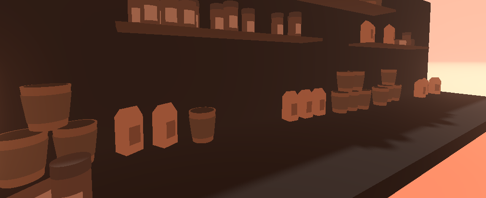
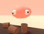

# Coffee Shop Game

Small simulator game I'm developing in Godot, with [barinovadn](https://github.com/barinovadn) on the models part. 

> [!WARNING]
> The project is currently on pause but the work may continue in the near future. 
> If you're interested in contributing contact [me](../../../) or look for [open issues](../../issues)!

# Gameplay

## 🌶️ Latest changes

* You can now pour certain ingredients like `milk` into cups.

## 🧊 Ingredients

Currently there are two ingidients in the game:
- `Milk`
- And `coffee mixture`

> [!NOTE]
> Support for extra ingredients & more complex recipes was already implemented.

Some of them, like `milk` are interactable: You can start pouring it while you hold it.

You make coffee by combining named ingredients in a cup, to do so just drag & drop or slowly pour the ingredients in it.

## ☕ Coffee Math

Currently you can make a total of 5 drinks out of these two ingredients:
1. `Espresso` (100% coffee, 0% milk)
1. `Espresso Macchiato` (75/25)
1. `Flat White` (25/75)
1. `Cappuccino` (20/80)
1. `Latte` (14.3/85.3)

This customer dummy will analyse your drink, by:

*Calculating the average match percentage between the ingredients ratio in the recipe and the ingredients ratio in the cup.*

To make sure you get it's order right, or at least close enough!
